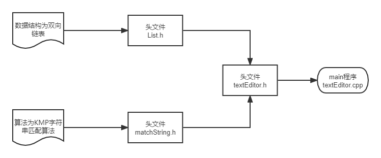

# 简单的文本编辑器
## 文件简介
有8个文件:  
1. Readme.md 说明文档  即该文档
2. List.h 我自己设计并进行良好封装的链表类  
3. textEditor.h 程序实现的头文件  
4. matchString.h字符串匹配头文件
5. textEditor.cpp 程序实现的主程序
6. in.txt 测试输入文本
7. out.txt 测试输出文本  
8. img.png 流程示意图
## 功能
基本命令 大小写字母都可以输入  

    R:读取文本文件  
    W:将缓冲区的内容都写入文本  
    I:插入单个新行 输入新行和行号  
    D:删除该行并移动到下一行  
    F:查找目标串的第一行  
    C:将目标字符串修改为对应字符串
    Q:退出编辑器立即结束  
    H:显示所有命令的帮助消息 '?'程序也能接受  
    N:当前行移动到下一行  
    P:当前行移动到上一行  
    B:当前行移动到首一行  
    E:当前行移动到尾一行  
    G:当前行移动到指定行号  
    V:查看缓冲区的全部内容  
对应函数:  

    R: void ReadText(string s);  
    W: void WriteText(string s);  
    I: void InsertLine(string s, int num);  
    D: void DeleteLine();  
    F: void FindLine(string s, int num);  
    C: void ChangeText(string s, string s1, int num);  
    Q: int Quit();  
    H: void Help();  
    N: void NextLine();  
    P: void PrevLine();  
    B: void BeginLine();  
    E: void EndLine();  
    G: void GotoLine(int num); 
    V: void ViewText();  
## 算法描述

List.h  

    良好封装了一系列双向列表模板类的接口
    详情见代码清单
matchString.h 

    KMP算法来服务于 FindLine 和 ChangeText 函数

textEditor.h 

    有四个私有成员
    List<string> textBuff;
    List<string> textBuff;//缓冲区
	int curNo;//当前行号
	ListNodePosi<string> cur;//当前行
	bool f;//判断是否输入了文本
    以及实现上述功能的函数

textEditor.cpp

    主程序实现人机交互
    通过while(1)函数不断读取终端输入
    通过命令台和用户交互

