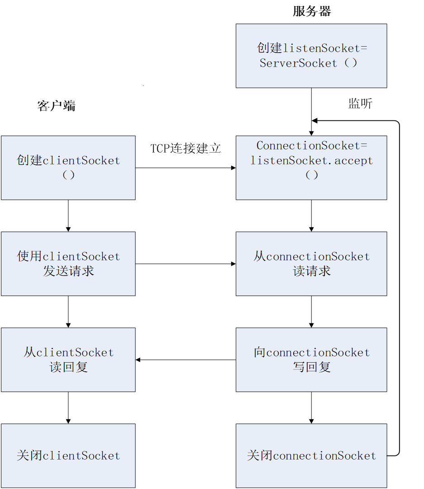

# 基于tcp协议网络的socket编程

[socket编程分析](https://www.cnblogs.com/chenzhenhong/p/13885290.html)

## 本实验的应用层协议设计如下

1. 协议格式： ACSII码字符，回车作为消息的结束

2. 协议的工作原理

    1. Client 从标准键盘中读入一行字符，通过Socket发送到服务器；收到服务器反馈的信息，将信息显示在标准输出屏幕上；关闭连接。

    2. Server 从Socket中读出客户端发送的字符串信息；计算字符串的长度；将计算的结果通过Socket发送给客户端。

## Client 和 Server 的功能

### Server

1. 建立服务器倾听Socket listenSocket=ServerSocker()

2. 等待并接收连接请求

3. 接受请求后创建连接Socket ConnectionSocket=listenSocket.accept()

4. InputStream 从connectionSocket读请求

5. OutputStreamm 向connectionSocket写回复

6. 关闭connectionSocket

### Client

1. 创建连接clientSocket, 向服务器发送请求

2. OutputStream 从clientSocket读回复

3. InputStream 向clientSocket写请求

4. 关闭socket以及相关资源

## 建立通信规则

Server 和 Client之间需要约定相同的规则，以保证正常通信。之后的程序设计， 我们约定：

1. Client 连接Server，连接成功以后，Server首先先给Client发送一条欢迎信息：Hello

2. Client 程序每发送一条信息给Server， Server接受并回送该信息的长度到Client，Client接受并显示该信息

3. 当Client发送"bye"，则对话结束。
