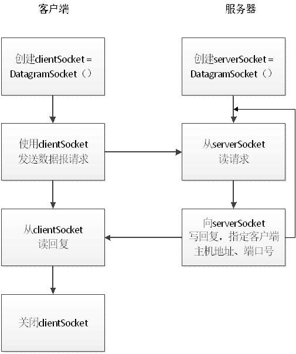

# 基于udp协议网络的socket编程

[udp java实现](https://www.cnblogs.com/chenzhenhong/p/13825286.html)

## 本实验的应用层协议设计如下

1. 协议格式： ACSII码字符，回车作为消息的结束

2. 协议的工作原理

    1. Client 从标准键盘中读入一行字符，通过Socket发送到服务器；收到服务器反馈的信息，将信息显示在标准输出屏幕上；关闭连接。

    2. Server 从Socket中读出客户端发送的字符串信息；进行逆序转换；将转换的结果通过Socket发送给客户端。

## Client 和 Server 的功能

### Server

1. 建立服务器Socket监听 serverSocket=DatagramSocker()

2. 等待并接收请求

3. 从serverSocket读请求

4. 向serverSocket写回复，指定客户端主机地址ip address, 端口号 port

5. 回到2.

### Client

1. 创建socket以及缓冲区的定义,clientSocket=DatagramSocket()
2. 使用clientSockrt发送数据报文请求
3. 从clientSocket读回复
4. 关闭clientSocket以及相关资源

## 通信规则

1. Client 发送“bye", 即为主动结束通信
